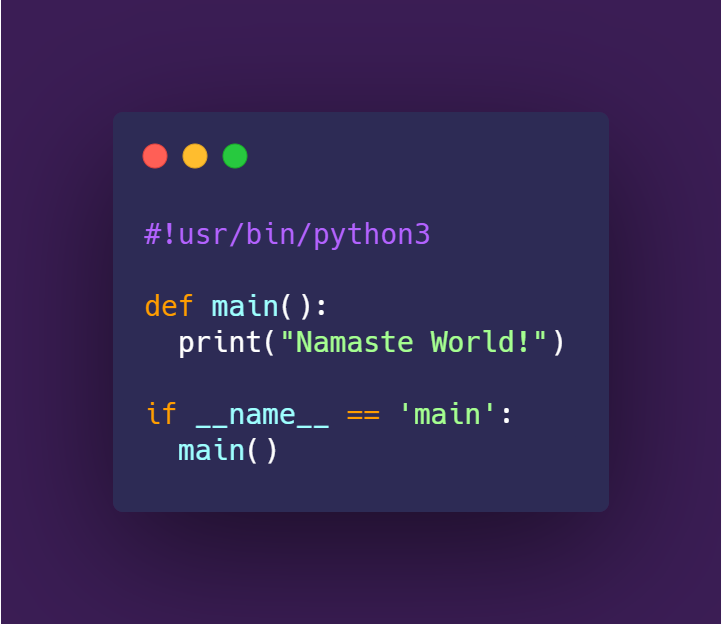

<h3 align='center'>Namaste Fellow Devs! I am Sk9👋</h3>

</img>

### About me:
- 🌱 I am currently working on the backend of Engrafa
- 💬 Ask me about **Python**
- 📫 You can contact me on **Discord**, *Sk9Programmer#9673*
- **Languages in which I master** : Python
- **Languages I somewhat know**: Golang, JavaScript
- **Languages I wanna learn** : Lua, Dart(Flutter), Kotlin, Java, C, , C++,
- **Frontend styling Frameworks I know** : HTML-CSS(Styling languages not frameworks), Angular JS, somewhat React Js

**Goals for this year 🥅:**
  - [x] Use VM's
  - [ ] Contribute in Ethical Hacking
  - [ ] Learn Lua 📝
  - [ ] Make a game with Unity 🎮
  - [ ] Do some Game development 🎮
  - [ ] Learn Java 📝
  - [ ] Try out MetsploitableOS 💻
  - [ ] Install UBUNTU 🕶️

**Tools I use:**
  - **Distro:** Debian 💻
  - **WM:**  Awesome
  - **Text Editor:** Vim, Vscode 

  
 Hobbies 🎮 

   
  
 -> Programming, playing cricket and occasionally reading some books 

  
 Fonts I like 🖋️ 

   
  
 -> JetBrains Mono, Fira Code, Fantasque Sans Mono, Montserrat, Lato, Kungfont, Segoe Script & Segoe Print 

  
 I have done numerous projects using Python including: 

   
  

  - Face Mask Detector
  - Numerous Discord Bots
  - Minecraft Clone(using ursina engine)
  - Websites using Flask and Django
  - AI Chatbot
  - Machine learning models
  - GUI chat application
  - Web Scraping
  - GUI music players
  - Mac Address changer
  - Malware
  

  
 I have contributed in open-source projects like: 

   
  

    Pytest,
    Engrafa:Yaguide. 
    Check out both of them on GitHub
  

    

  
 Profile Stats 

   
    

Happy coding!
